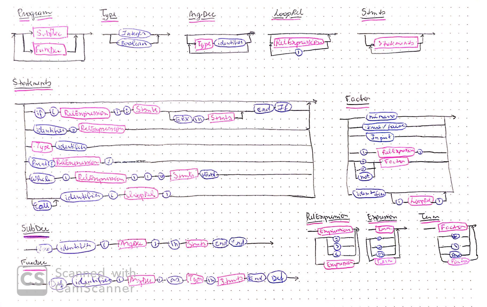

# Compilador Bebêlles

### EBNF:
##### Program = {("Void", SubDec) | ("Def", FuncDec)};

##### SubDec = "Void", identifier, "(" ("" | ArgDec), ")", "\n", Stmts, "End, "Void"

##### FuncDec = "Def", identifier, "(" ("" | ArgDec), ")", "as", Type, "\n", Stmts, "End, "Def"

##### Statement = "" | (identifier, "=", relexpression) | ("PRINT", "(", relexpression, ")") | (Type, identifier) |  ("While", "(", relexpression, ")", ":", "\n" Stmts, "Wend") | ("If", "(", relexpression, ")", ":", "\n", Stmts, {"Else", "\n", Stmts, "End", "If") | ("call", identifier, ("(", LoopRel | "", ")") | "");

##### Relexpression = expression, {("="|">"|"<"), expression};

##### Expression = term, {("+"|"-"|"or"), term};

##### Term = factor, {("*"|"/"|"and"), factor};

##### Factor = number | ("True"|"False) | (identifier, "" | ("(", LoopRel | "", ")") ) | ("(", relexpression, ")") | (("+"|"-"|"not"), factor) | "Input";

##### Type = "Integer"|"Boolean";

##### Stmts = ("" | Statements, {Statement, "\n"})

##### ArgDec = ("" | Type, identifier,  { "," Type, identifier })

##### LoopRel = ("" | Relexpression, {",", Relexpression})

### Diagrama Sintático:

